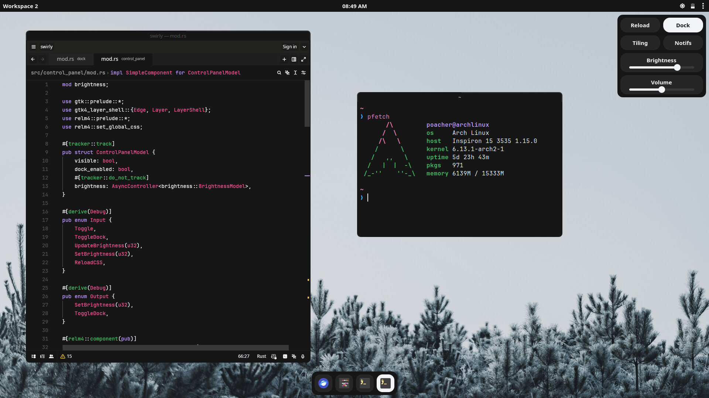

# Swirly
Swirly is a Rust-based desktop shell for the Sway compositor.



## Dependencies
**NOTE: THIS IS NOT A COMPREHENSIVE LIST, CREATE AN ISSUE IF A DEPENDENCY IS NOT LISTED HERE.**

`rust`

`sway`

`gtk4`

`gcc`

`pulseaudio`

`brightnessctl` (optional fallback brightness control)

`swaync` (optional notifications)

## Configuration
Configuration files are stored within `XDG_CONFIG_HOME/swirly/` or `HOME/.config/swirly/`.

### Overrides
`overrides.toml` allows you to override the icons that appear in the dock.

Example:
```toml
original_names = ["dev.zed.Zed", "zen"]
replacement_names = ["lite", "browser"]
```

### Launchables
`launchables.toml` allows you to add program icons to the dock which execute a command.

Example:
```toml
icons = ["lite", "browser", "nemo", "foot", "obsidian"]
commands = ["zeditor", "zen-browser", "nemo", "foot", "obsidian"]
```
